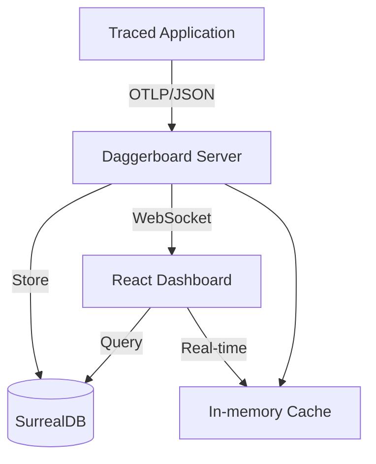

<div align="center">


# Daggerboard

**Premium Real-time OTLP Trace Visualization & Historical Analysis Engine**

[](https://opensource.org/licenses/MIT)
[](https://opentelemetry.io/)
[](https://surrealdb.com/)
[](https://reactjs.org/)

</div>

---

## 🚀 Overview

**Daggerboard** is a state-of-the-art observability dashboard designed to visualize OpenTelemetry (OTLP) traces in real-time. Built for high-performance cloud-native systems, it provides deep visibility into complex microservice interactions, helping developers identify bottlenecks, trace error propagation, and analyze historical performance trends with ease.

By combining a lighting-fast React frontend with a robust SurrealDB backend, Daggerboard offers both instantaneous real-time updates and long-term persistence for deep-dive historical correlation.

## ✨ Key Features

### 🔴 Real-Time Observability
Experience live trace streams as they happen. Daggerboard's WebSocket-powered UI updates instantly when new OTLP data arrives.

### 💾 Persistent Historical Analysis
Leverage the power of **SurrealDB** to store and query millions of spans. Analyze trends over days, weeks, or months without sacrificing performance.

### 📊 Performance Analytics
- **Service Inventory**: Deep-dive metrics for every discovered service, including error rates and activity tracking.
- **Trace Scatter Plot**: Quick-glance latency distribution analysis with direct trace navigation.
- **Latency Percentiles**: P50/P99 metrics between any service pair.

### 🔗 Dynamic Service Topology
Automatically map your system's architecture. Visualize service-to-service dependencies, call frequencies, and latency hotspots in an interactive graph.

### 🚨 Advanced Error Tracking
Daggerboard doesn't just show errors; it tracks their **propagation**. See exactly how a failure in a downstream database call impacts your top-level API response.

### 📊 Performance DSL
Rich analytics featuring P50/P99 latency percentiles between any service pair, error rate distribution, and critical path highlighting in every trace.

---

## 📸 Guided Tour

### Interactive Trace Visualization
Navigate complex traces with the nested tree and timeline views. Spot performance issues at a glance with critical path highlighting.

<div align="center">

</div>

### Service Topology Mapping
Visualize your microservices ecosystem and understand exactly how data flows through your system.

<div align="center">

</div>

---

## 🛠️ Quick Start

### 🐳 Docker (Recommended) - Zero Config Setup

**Prerequisites:** Docker & Docker Compose only

```bash
git clone https://github.com/your-org/Daggerboard.git
cd Daggerboard
docker-compose up
```

That's it! ✨ The system automatically:
- ✅ Starts SurrealDB database
- ✅ Initializes schema (tables, indexes, metadata)
- ✅ Starts Daggerboard application
- ✅ Ready for traces in ~10-15 seconds

**Access:**
- 📊 Dashboard: http://localhost:3000
- 📡 OTLP Receiver: http://localhost:4318
- 💾 Database: ws://localhost:8000

**Development with hot-reload:**
```bash
docker-compose -f docker-compose.dev.yml up
```

See [DOCKER.md](DOCKER.md) and [AUTOMATED_SETUP.md](AUTOMATED_SETUP.md) for full details.

### 💻 Local Development (Alternative)

**Prerequisites:** Node.js (v18+)

```bash
git clone https://github.com/your-org/Daggerboard.git
cd Daggerboard
npm install
npm run dev
```

**Configuration:** Create `.env.local`:
```bash
GEMINI_API_KEY="your-api-key"
DB_PATH="file://./daggerboard.db"
PORT=3000
OTLP_PORT=4318
```

**Access:**
- 📊 Dashboard: http://localhost:3000
- 📡 OTLP Receiver: http://localhost:4318

### 📡 Send Sample Traces
Configure your application to export OTLP data to Daggerboard:
```bash
export OTEL_EXPORTER_OTLP_ENDPOINT=http://localhost:4318
export OTEL_EXPORTER_OTLP_PROTOCOL=http/json
# Run your traced application
```

---

## 🏗️ Architecture



## ⚙️ Configuration

| Variable | Default | Description |
|----------|---------|-------------|
| `PORT` | `3000` | Port for the web dashboard |
| `OTLP_PORT` | `4318` | Port for the OTLP/HTTP receiver |
| `DB_PATH` | `file://./daggerboard.db` | SurrealDB connection string |
| `GEMINI_API_KEY` | - | Required for AI-powered insights (optional) |

---

## 📄 License
Daggerboard is released under the [MIT License](LICENSE).

---

<div align="center">
Built with ❤️ for the OpenTelemetry ecosystem.
</div>
